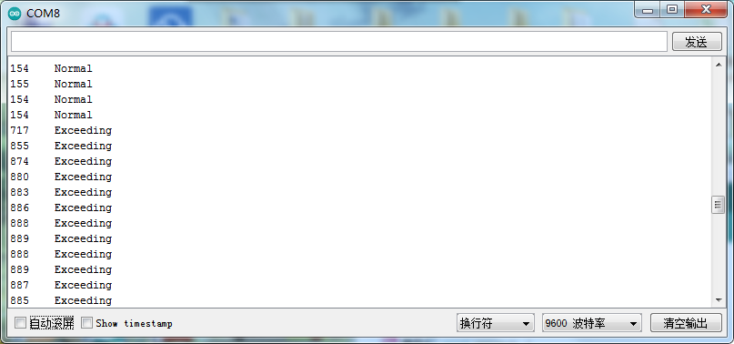

# Arduino


## 1. Arduino简介  

Arduino是一款开源电子原型平台，旨在简化硬件开发和程序设计。Arduino控制板系列能够支持多种编程语言，如C和C++，使初学者和专业人士都能创建实时、交互式的项目。Arduino广泛应用于电子设备的研发、机器人、互联网医疗和环境监测等领域。其强大的社区支持与丰富的开源资源为开发者提供了充足的教育和学习材料，帮助他们快速上手并实现自己的创意。此外，Arduino IDE提供了一种简单易用的界面，可以轻松地进行代码编写与上传。  

## 2. 连接图  

  

## 3. 测试代码  

```cpp  
int digitalPin = 3;  
int analogPin = A0;  

// 以下两个变量分别存放数字信号与模拟信号  
int analogVal = 0;  
int digitalVal = 0;  

void setup() {  
    Serial.begin(9600); // 设置波特率为9600  
    pinMode(digitalPin, INPUT); // 数字引脚3设置为输入模式  
    pinMode(analogPin, INPUT); // 模拟引脚A0设置为输入模式  
}  

void loop() {  
    analogVal = analogRead(analogPin); // 读取模拟信号  
    digitalVal = digitalRead(digitalPin); // 读取数字信号  
    Serial.print(analogVal);  
    
    if (digitalVal == 1) {  
        Serial.println(" Normal");  
    } else {  
        Serial.println(" Exceeding");  
    }  
    
    delay(100); // 延时100毫秒  
}  
```  

## 4. 测试结果  

上传测试代码成功，利用USB线上电后，模块上红LED点亮，打开串口监视器，设置波特率为9600。串口监视器显示对应数据和字符，如下图所示。  




