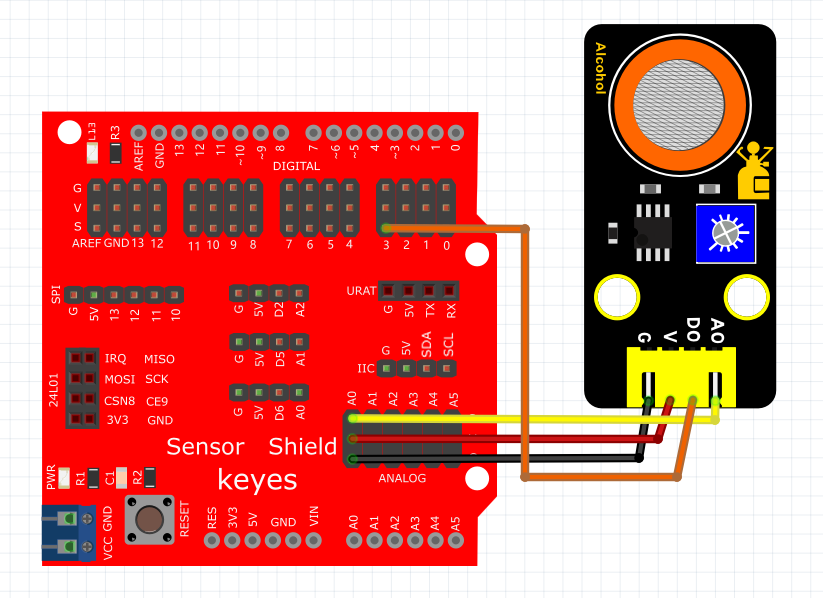
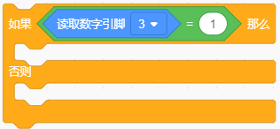
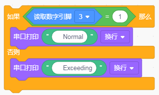
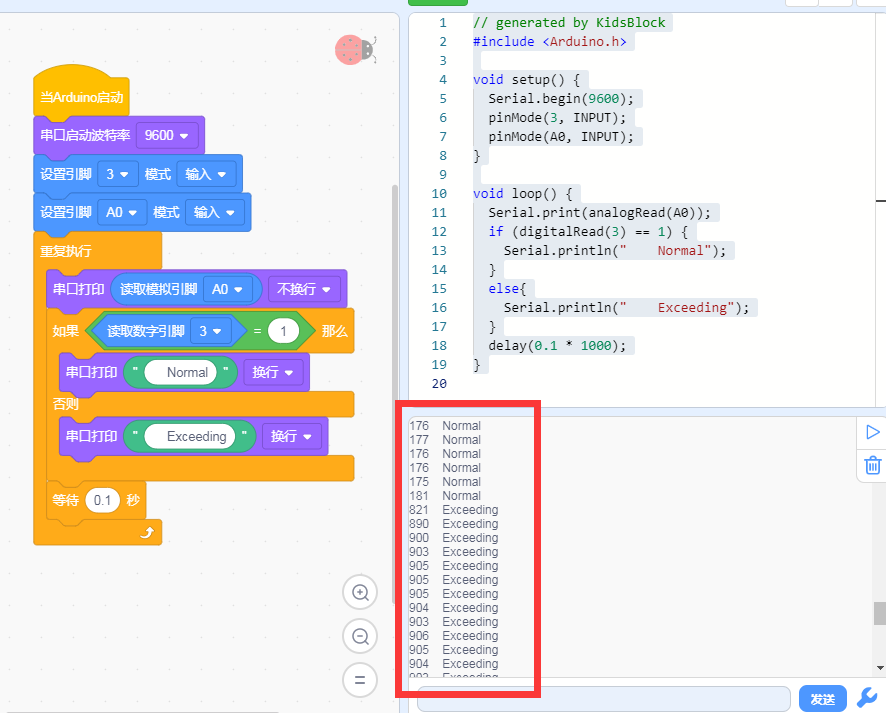

# KidsBlock

## 1. KidsBlock简介  

KidsBlock是一款图形化编程工具，专为儿童和初学者设计，旨在通过简单的拖放界面引导用户进行编程学习。该工具允许用户通过积木式模块来构建程序，而无需了解复杂的编程语法。KidsBlock支持与Arduino平台及其他硬件的集成，使用户能够快速上手，进行各种电子项目的创造，如机器人、传感器应用等。该工具追求简单易用的理念，适合教育场景，尤其是编程教学和STEAM教育，帮助学生培养逻辑思维和解决问题的能力。  

## 2. 连接图  

  

## 3. 测试代码  

1. 在事件栏拖出Arduino启动模块，然后在串口栏拖出串口启动波特率模块并设置为9600。  

     

2. 在引脚栏拖出两个设置引脚模式模块，一个设置为引脚3输入；另一个设置为引脚A0输入。  

     

3. 在控制栏拖出重复执行模块。  

     

4. 在串口栏拖出打印模块，然后在引脚栏拖出读取模拟引脚模块设置引脚为A0，放在打印模块的格子里，并设置串口打印不换行。  

     

5. 在控制栏拖出判断模块，然后在判断模块里添加运算的等于模块，等于模块的左边添加读取数字引脚3模块，右边为0。  

     

6. 在串口栏拖出串口打印模块，然后添加文本栏拖出文本模块设置文本为“Normal”。  

7. 在串口栏拖出串口打印模块，然后添加文本栏拖出文本模块设置文本为“Exceeding”。  

8. 把串口打印代码块添加在判断模块中。  

     

9. 在控制栏拖出延时模块并设置延时为100ms。  

     

## 4. 测试结果  

上传测试代码成功，利用USB线上电后，模块上红LED点亮，打开串口监视器，设置波特率为9600。串口监视器显示对应数据和字符，如下图所示。  

