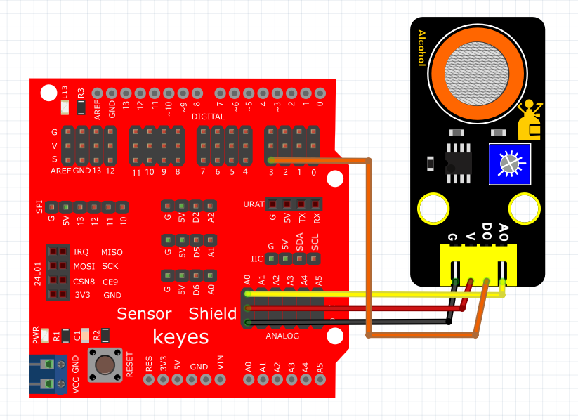

# Mixly

## 1. Mixly简介  

Mixly是一款图形化编程工具，专为儿童和初学者设计，旨在通过直观的积木式界面来让用户轻松学习编程。用户可以通过拖放不同的功能模块，直观地构建程序，而无需深入复杂的编程语言。Mixly支持Arduino平台，并能够与其他硬件兼容，使得它适合于多种电子项目的开发，包括机器人、传感器应用等。通过提供多种编程语言（如C语言、Scratch和Mixly图形编程）的支持，Mixly既能满足新手的学习需求，又能让有经验的开发者快速实现他们的创意。在教育和自学中，Mixly作为一种有趣的学习工具，可以有效地提高逻辑思维和问题解决能力。  

## 2. 连接图  

  

## 3. 测试代码  

1. 在变量栏拖声明变量模块并设置变量名为digitalPin，赋值为0。  

     

2. 在变量栏拖出变量digitalPin赋值模块，并赋值数字引脚3的值。  

     

3. 在串口栏拖出打印模块，并添加打印值为模拟引脚A0。  

     

4. 在控制栏拖出判断模块。  

     

5. 在判断模块里添加逻辑栏中的等于模块，然后在等于模块里添加变量栏中的digitalPin变量模块，右边为数字0。  

     

6. 在串口栏拖出串口打印（自动换行）模块并添加文本栏中的文本模块，设置文本为“Normal”；同样的操作设置文本为“Exceeding”。  

     

7. 在控制栏拖出延时模块并设置延时为100ms。  

     

## 4. 测试结果  

上传测试代码成功，利用USB线上电后，模块上红LED点亮，打开串口监视器，设置波特率为9600。串口监视器显示对应数据和字符，如下图所示。  

