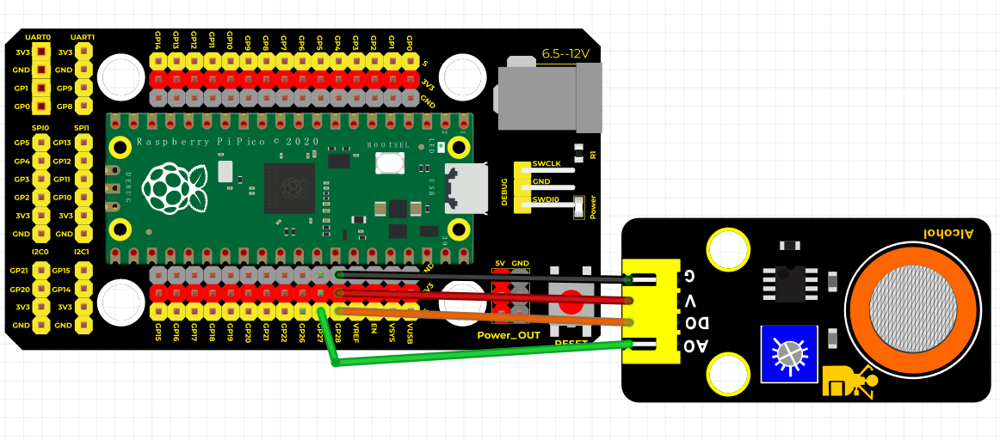
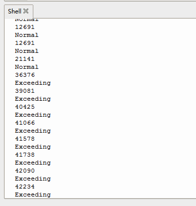

# Python


## 1. Python简介  

Python是一种广泛使用的高级编程语言，以其简洁的语法和强大的功能而受到开发者的青睐。自1991年首次发布以来，Python已成为数据科学、机器学习、Web开发和自动化等领域的核心语言。Python不仅支持多种编程范式（如面向对象、结构化和函数式编程），而且拥有一个庞大的社区和丰富的第三方库，方便开发者快速构建复杂的应用程序。Python的简易性和灵活性使其成为初学者和专家都能轻松使用的语言。许多教育机构选择Python作为编程入门语言，帮助学生建立扎实的编程基础。  

## 2. 连接图  

  

## 3. 测试代码  

```python  
import machine  
import utime  

digitalPin = machine.Pin(28, machine.Pin.IN)  # 设置28脚为数字信号  
analogPin = machine.ADC(27)  # 设置27脚为模拟信号  

while True:  
    reading = analogPin.read_u16()  # 读取模拟信号  
    print(reading)  # 打印模拟值  
    if digitalPin.value() == 1:  # 判断数字信号是否为1  
        print("Normal")  
    else:  
        print("Exceeding")  
    utime.sleep_ms(100)  # 延时100毫秒  
```  

## 4. 测试结果  

上传测试代码成功，利用USB线上电后，模块上红LED点亮，运行代码后可以看见相应的数字和文字，如下图所示。  




